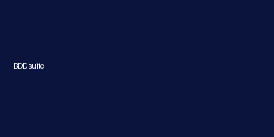

# CodeAgents Mobile

An mobile client to Claude Code for iOS.
Allows you to run Claude code on any Linux ssh server.


**TestFlight Beta**

https://testflight.apple.com/join/eUpweBZV

**AppStore**

https://apps.apple.com/app/codeagents-mobile/id6748273716

## Screenshots

   


## Features
- **NEW** Provision servers with Digital Ocean / Hetzner 
- **NEW** Auto install Claude Code for provisioned servers
- **NEW** Auto create SSH keys
- MCP servers support 
- Connect to remote servers via SSH
- Interact with Claude Code through a native iOS interface
- Supports both API key and subscription-based authentication (OAuth tokens)
- Browse files on remote servers
- Real-time chat with Claude Code

## Requirements

- iOS 17.0+
- Xcode 15+
- Swift 5.9+

## CI & Quality
- `fastlane tests` runs unit tests on macOS runners via the **iOS Build & TestFlight** workflow.
- `fastlane beta` builds and uploads to TestFlight (requires App Store Connect secrets in GitHub Actions).
- `fastlane bdd` executes executable specs (pytest-bdd) and produces the VHS recording below via the **BDD Suite** workflow.
- BDD console demo (auto-regenerated in CI):



Run locally:
```bash
python -m pip install -r bdd/requirements.txt
python -m pytest bdd -q
```

## Getting Started

```bash
# Clone the repository
git clone [repository-url]

# Open in Xcode
open CodeAgentsMobile.xcodeproj

# Build and run
# Select your target device/simulator and press Cmd+R
```


## Architecture

Built with SwiftUI and SwiftData following MVVM pattern.
Icon - https://tabler.io/icons/icon/brain, edited here https://icon.kitchen

## License

This project is licensed under the Apache License, Version 2.0 - see the [LICENSE](LICENSE) file for details.
